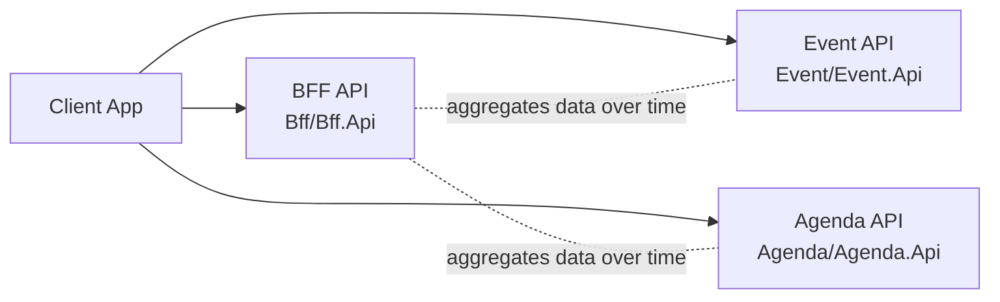

# Personal Event Planner

Personal Event Planner is a .NET-based microservice sample composed of three bounded contexts:

1. Event service
2. Agenda service
3. BFF service

Each bounded context is isolated in its own solution and contains:

1. One ASP.NET Core Web API project (`*.Api`)
2. One domain class library (`*.Domain`)

## Architecture

At the repository root, `EventPlanner.sln` references all projects. The service-level solutions are:

1. `Event/Event.sln`
2. `Agenda/Agenda.sln`
3. `Bff/Bff.sln`

Current API responsibilities:

1. Event API exposes event endpoints (`/api/events`)
2. Agenda API exposes agenda endpoints (`/api/agenda`)
3. BFF API exposes dashboard endpoints (`/api/dashboard/{userId}`)

All APIs currently use a lightweight setup with controllers and OpenAPI in development.



## Repository Structure

```text
.
|- EventPlanner.sln
|- Bff/
|  |- Bff.sln
|  |- Bff.Api/
|  \- Bff.Domain/
|- Event/
|  |- Event.sln
|  |- Event.Api/
|  \- Event.Domain/
\- Agenda/
   |- Agenda.sln
   |- Agenda.Api/
   \- Agenda.Domain/
```

## Technology Stack

Runtime and language:

1. C#
2. .NET 10 (`net10.0`) across all projects
3. ASP.NET Core Web API

API documentation:

1. `Microsoft.AspNetCore.OpenApi` 10.0.0
2. `Microsoft.OpenApi` 2.7.5

Containerization and deployment:

1. Docker (one Dockerfile per API)
2. Azure Container Registry (ACR)
3. Azure Container Apps
4. GitHub Actions (service-specific + reusable shared workflow)

Cloud authentication and secrets:

1. GitHub OIDC federation with Azure (`azure/login@v3`)
2. Azure Key Vault for registry credentials
3. Azure RBAC for deployment and secret read permissions

## Local Development

Prerequisites:

1. .NET SDK 10.x
2. Docker (optional, for container builds)

Run each service from the repository root:

```bash
dotnet run --project Bff/Bff.Api/Bff.Api.csproj
dotnet run --project Event/Event.Api/Event.Api.csproj
dotnet run --project Agenda/Agenda.Api/Agenda.Api.csproj
```

Or use the predefined VS Code tasks:

1. `Run BFF API`
2. `Run Event API`
3. `Run Agenda API`
4. `Run All APIs`

## Deployment Model (Recommended)

The repository is designed to deploy each API independently to Azure Container Apps through GitHub Actions.

### Workflows

Service entry workflows:

1. `.github/workflows/build-events.yml`
2. `.github/workflows/build-agenda.yml`
3. `.github/workflows/build-bff.yml`

Shared reusable workflow:

1. `.github/workflows/build-and-deploy-dotnet-webapp.yml`

### Pipeline Stages

Each service workflow calls the shared workflow with service-specific inputs and runs:

1. `ci`
2. `build_and_push`
3. `deploy`

Stage behavior:

1. `ci`: restore, build, test, publish test artifacts
2. `build_and_push`: Azure login (OIDC), read ACR credentials from Key Vault, build and push image to ACR
3. `deploy`: deploy immutable SHA-tagged image to Azure Container Apps

### Required GitHub Secrets

Configure these repository or environment secrets:

1. `AZURE_CLIENT_ID`
2. `AZURE_TENANT_ID`
3. `AZURE_SUBSCRIPTION_ID`

### Required Azure Resources

1. Azure Container Registry
2. Azure Container Apps environment and app instances
3. Azure Key Vault storing registry username/password secrets
4. Entra application with federated credentials for GitHub OIDC
5. RBAC assignments for deployment and Key Vault secret access

## Notes

1. API OpenAPI documents are mapped only in development.
2. There are currently no test projects in the repository, so `dotnet test` coverage is limited to what exists.
3. For deeper deployment details and operational troubleshooting, see `architecture.md`.